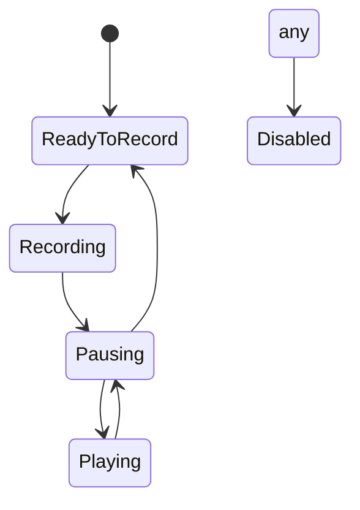

# XR Loop Pedal - Orb System Architecture

## Overview
The orb system is designed to handle audio recording and playback in a loop pedal style interface. Each orb represents a single audio track that can be recorded, played, and paused independently.

## Core Components

### 1. AudioOrbController
The main controller that coordinates between audio and visual components.

#### State Management
The orb operates as a state machine with the following states:
- `ReadyToRecord`: Initial state, ready to start recording
- `Recording`: Currently recording audio
- `Pausing`: Transitional state between recording/playing
- `Playing`: Playing back recorded audio
- `Disabled`: Orb is inactive

#### State Transitions


#### Valid State Transitions
- `ReadyToRecord` → `Recording`: Start new recording
- `Recording` → `Pausing`: Stop recording
- `Playing` → `Pausing`: Stop playback
- `Pausing` → `Playing`: Start playback
- Any state → `Disabled`: Emergency stop

### 2. OrbParticleController
Handles all visual feedback for the orb state and audio levels.

#### Features
- Color transitions based on state
- Alpha level based on audio volume
- Smooth transitions using DOTween

#### Configuration
```csharp
[Header("Alpha Settings")]
[SerializeField] private float alphaMax = 20f;    // Maximum alpha at full volume
[SerializeField] private float alphaMin = 2f;     // Minimum alpha at zero volume
[SerializeField] private float colorTransitionDuration = 0.3f;  // Color change speed
[SerializeField] private float volumeTransitionDuration = 0.1f; // Volume change speed
```

### 3. RecordAudioInterface
Handles the actual audio recording and playback functionality.

#### Features
- Audio recording
- Playback control
- Volume management
- File saving/loading

## State Colors
Colors are managed through the `LoopOrbStateColors` ScriptableObject:

| State | Default Color | Description |
|-------|--------------|-------------|
| ReadyToRecord | Green (0.2, 0.8, 0.2) | Ready to start recording |
| Recording | Red (0.8, 0.2, 0.2) | Currently recording |
| Pausing | Yellow (0.8, 0.8, 0.2) | Transitional state |
| Playing | Blue (0.2, 0.2, 0.8) | Playing back audio |
| Disabled | Gray (0.5, 0.5, 0.5) | Inactive state |

## Setup Instructions

1. Create an orb GameObject with:
   - AudioOrbController
   - OrbParticleController
   - ParticleSystem (child object)
   - RecordAudioInterface

2. Configure the OrbParticleController:
   - Assign the ParticleSystem reference
   - Adjust alpha and transition settings

3. Configure the AudioOrbController:
   - Assign the RecordAudioInterface reference
   - Assign the OrbParticleController reference

## Usage Example

```csharp
// Get reference to orb controller
AudioOrbController orb = GetComponent<AudioOrbController>();

// Start recording
orb.SetState(LoopOrbState.Recording);

// Stop recording
orb.SetState(LoopOrbState.Pausing);

// Play recorded audio
orb.SetState(LoopOrbState.Playing);
```

## Error Handling
The system includes comprehensive error checking:
- Invalid state transitions are logged
- Missing components are detected at startup
- Audio operations are validated
- Visual transitions are protected against null references

## Performance Considerations
- Uses DOTween for efficient animations
- Volume changes are smoothed to prevent visual jitter
- State changes are validated before execution
- Particle system updates are optimized 